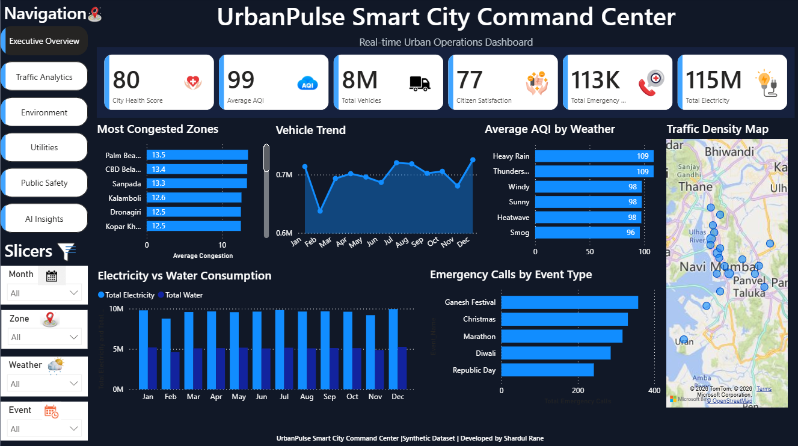
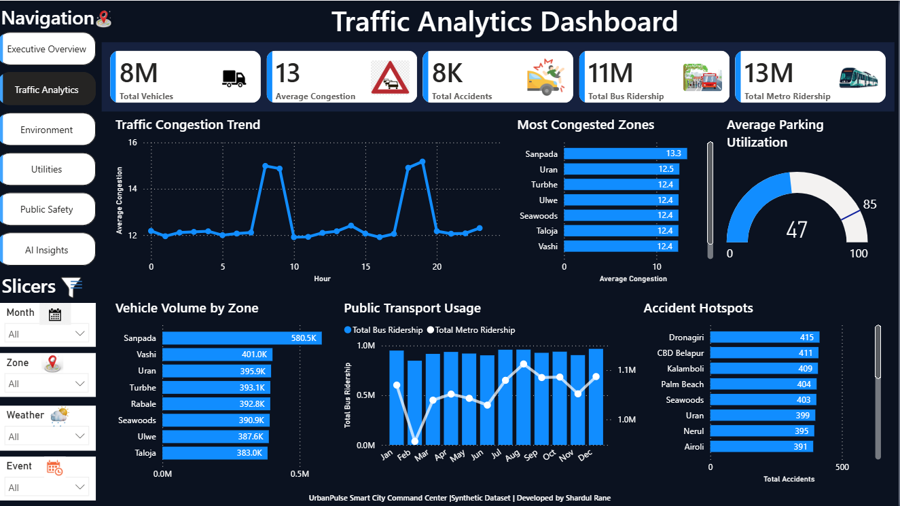
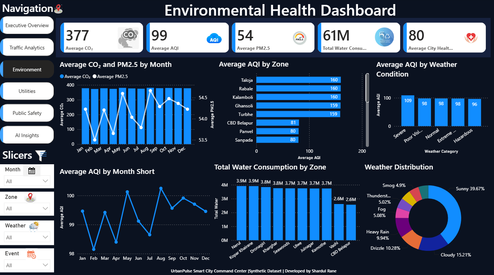
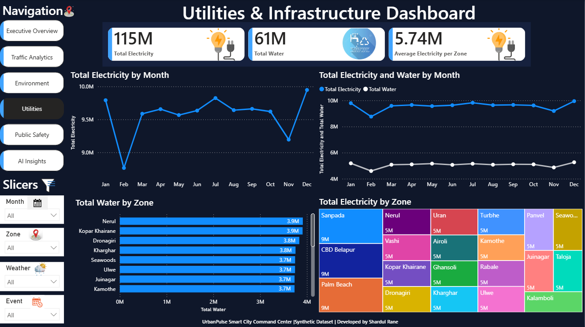
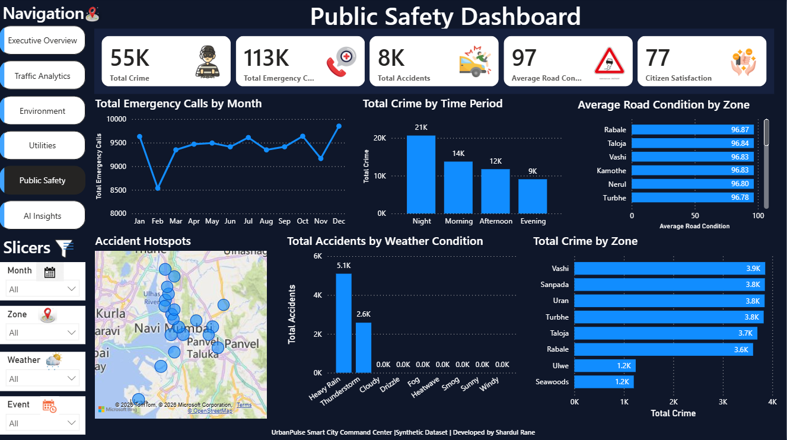
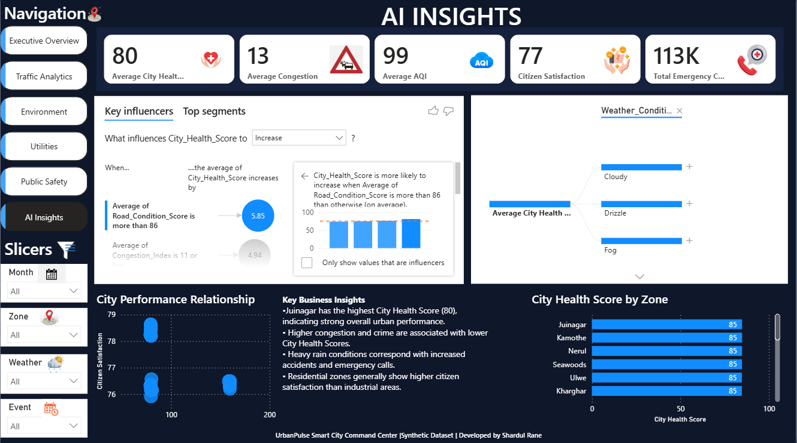

# 🚦 UrbanPulse Smart City Command Center


> **Built as part of my Data Analytics portfolio to demonstrate Power BI dashboard development, data modeling, DAX, and business intelligence skills.**

---

# 📸 Dashboard Preview



---

# 📖 Project Overview

UrbanPulse Smart City Command Center is a comprehensive **Power BI dashboard** that simulates a real-world Smart City analytics platform.

The project integrates data across **Traffic Management, Environment, Utilities, Public Safety, and AI-powered Insights** into a unified reporting solution, enabling users to monitor key performance indicators, identify operational trends, and support data-driven decision making.

The dashboard was developed using a **Star Schema data model**, **Power Query** for data transformation, and **DAX** for business calculations while maintaining a consistent enterprise-style user interface across multiple interactive dashboard pages.

> **Note:** This project uses a synthetic dataset created exclusively for learning, portfolio development, and demonstration purposes.

---

# 🎯 Dashboard Modules

## 🏙 Executive Overview

Provides a high-level snapshot of overall city performance.

### Highlights

- City Health Score
- Average AQI
- Total Vehicles
- Citizen Satisfaction
- Utility Consumption
- Emergency Calls
- Traffic Density Map

---

## 🚗 Traffic Analytics

Analyze transportation performance and congestion across the city.

### Highlights

- Vehicle Traffic Trend
- Congestion Analysis
- Vehicle Volume by Zone
- Public Transport Usage
- Parking Utilization
- Accident Hotspots

---

## 🌿 Environment Dashboard

Monitor environmental health indicators and sustainability metrics.

### Highlights

- AQI Monitoring
- PM2.5 Analysis
- CO₂ Monitoring
- Water Consumption
- Weather Distribution
- Environmental Trends

---

## ⚡ Utilities Dashboard

Track utility consumption and infrastructure performance.

### Highlights

- Electricity Consumption
- Water Consumption
- Monthly Utility Trends
- Zone-wise Utility Distribution

---

## 🚓 Public Safety Dashboard

Analyze public safety metrics across the city.

### Highlights

- Crime Analysis
- Emergency Calls
- Accident Analysis
- Road Condition Monitoring
- Crime Hotspots

---

## 🤖 AI Insights

Leverages Power BI AI visuals to identify meaningful patterns within the dataset.

### Highlights

- Key Influencers
- Decomposition Tree
- Business Insight Summary
- Zone Performance Analysis

---

# 📊 Key Performance Indicators (KPIs)

- City Health Score
- Average AQI
- Average PM2.5
- Average CO₂
- Average Congestion
- Citizen Satisfaction
- Total Vehicles
- Total Electricity Consumption
- Total Water Consumption
- Total Emergency Calls
- Total Crime
- Total Accidents

---

# 🛠 Tools & Technologies

- Microsoft Power BI Desktop
- Power Query
- DAX (Data Analysis Expressions)
- Star Schema Data Modeling
- Interactive Navigation Buttons
- Bookmarks
- Slicers
- Bing Maps
- Key Influencers
- Decomposition Tree
- Gauge Charts
- Treemap
- Scatter Charts
- Combo Charts
- Donut Charts
- Line Charts
- Bar Charts

---

# ✨ Features

- ✅ Multi-page Interactive Dashboard
- ✅ Professional Dark Theme UI
- ✅ Interactive Navigation Panel
- ✅ Dynamic KPI Cards
- ✅ Cross-filtering Between Visuals
- ✅ Interactive Slicers
- ✅ AI-Powered Power BI Visuals
- ✅ Geographic Analysis using Maps
- ✅ Star Schema Data Model
- ✅ Custom DAX Measures
- ✅ Responsive Dashboard Layout

---

# 💼 Skills Demonstrated

This project showcases practical skills in:

- Dashboard Design
- Business Intelligence
- KPI Development
- Data Visualization
- Data Storytelling
- Power Query (ETL)
- DAX Measures
- Star Schema Data Modeling
- Interactive Report Development
- AI Visuals in Power BI

---

# 📈 Key Insights

Some of the key insights derived from the dashboard include:

- Morning and evening hours consistently experience the highest traffic congestion.
- Higher congestion levels are generally associated with lower City Health Scores.
- Environmental conditions significantly influence AQI levels.
- Emergency call volumes increase during adverse weather conditions.
- Utility consumption varies across city zones, helping identify areas with higher infrastructure demand.
- Crime and accident hotspot analysis helps identify regions requiring improved public safety measures.

---

# 📂 Dataset

The dashboard uses a **synthetic Smart City dataset** generated specifically for this project to simulate real-world urban operations.

### Dataset Overview

**Rows:** 50,000+

**Domains Covered**

- Traffic
- Environment
- Utilities
- Public Safety
- Weather
- Transportation
- Citizen Satisfaction

**Purpose**

Educational learning, dashboard development, and portfolio demonstration.

---

# 📁 Repository Structure

```text
UrbanPulse-Smart-City
│
├── UrbanPulse.pbix
├── README.md
├── dashboard-preview.png
├── traffic-dashboard.png
├── environment-dashboard.png
├── utilities-dashboard.png
├── public-safety-dashboard.png
├── ai-insights-dashboard.png
└── dataset.csv
```

---

# 📸 Dashboard Gallery

## 🏙 Executive Overview


---

## 🚗 Traffic Analytics



---

## 🌿 Environment Dashboard



---

## ⚡ Utilities Dashboard



---

## 🚓 Public Safety Dashboard



---

## 🤖 AI Insights



---

# 🚀 Future Enhancements

- Publish the dashboard to Power BI Service
- Connect to SQL Server for live reporting
- Implement Real-Time Data Refresh
- Add Predictive Analytics using Python
- Apply Row-Level Security (RLS)
- Expand AI-driven analytical capabilities

---

# 👨‍💻 Author

## **Shardul Rane**

**Aspiring Data Analyst**

### 📬 Connect with Me

- 💼 **LinkedIn:** https://www.linkedin.com/in/shardulrane22

### 🛠 Skills

- 📊 Power BI
- 🗄 SQL
- 📈 Microsoft Excel
- 📐 DAX
- 🔄 Power Query
- 🐍 Python *(Currently Learning)*
- 📉 Data Visualization

---

## ⭐ Support

If you found this project interesting, consider giving the repository a **⭐ Star**.

Thank you for visiting my project! 🚀
